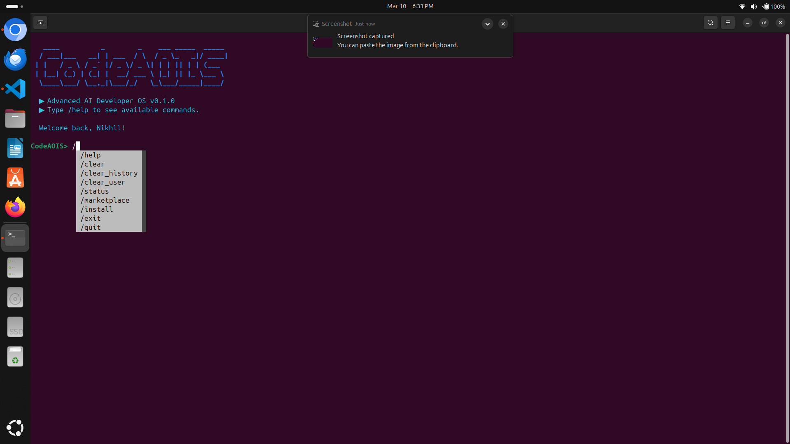
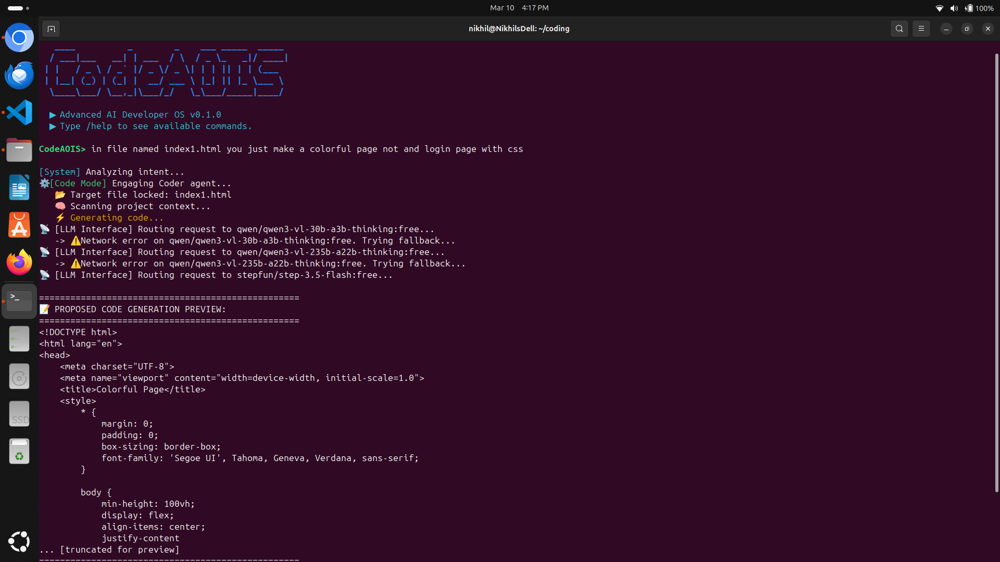
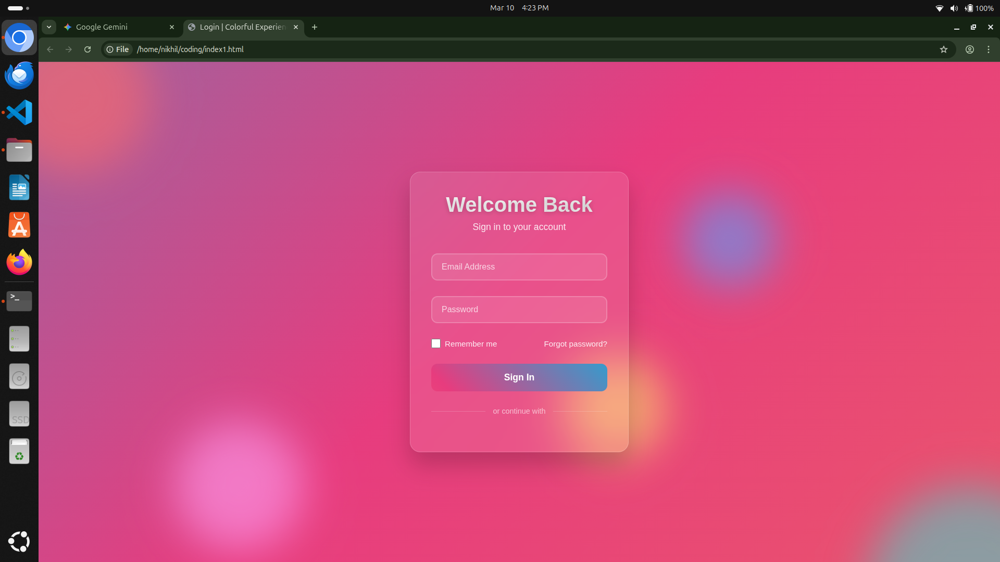

# CodeAOIS

# 💻 CodeAOIS (v0.3.0) - Advanced Developer OS
An elite, autonomous AI operating system for your terminal. CodeAOIS doesn't just chat; it reads your codebase, runs its own code, and fixes its own bugs.

## 🔥 Core Pillars
1. **Global Cloud Identity:** Secure, OTP-based login via private SMTP. Your history, developer profile, and token usage follow you to any machine via Supabase.
2. **Autonomous Execution Loop:** The OS executes generated Python scripts locally. If it hits a `Traceback` error, it autonomously feeds the crash data back to the LLM and self-corrects the code.
3. **Local Codebase Brain (RAG):** Type `/index` to calculate embeddings for your entire local project. CodeAOIS instantly retrieves semantic context so you never have to copy-paste your code again.
4. **LLM Supervisor Engine:** An intelligent routing system that determines if you want to chat, execute a terminal command, or write a new script, routing tasks to specialized agents seamlessly.

## ⚡ Quick Start
```bash
pip install -r requirements.txt
codeaois
```

### Advanced AI Developer Operating System

CodeAOIS is an experimental **AI-powered developer operating system** that allows developers to interact with an AI coding system directly from the terminal.

Instead of simple autocomplete tools, CodeAOIS acts like an **AI developer partner** capable of understanding instructions, generating code, and managing development workflows.

The system is designed around a **multi-agent architecture** where specialized agents collaborate to perform tasks such as coding, testing, and project management.

---

# ✨ Features

• Natural language coding from terminal
• Multi-agent AI architecture
• Automatic code generation
• Project context scanning
• Agent marketplace system
• AI memory and context tracking
• Modular and extensible design

---

# 🧠 How CodeAOIS Works

CodeAOIS works like an **AI operating system for developers**.

You simply describe what you want to build, and the system:

1. Understands your request
2. Scans the project context
3. Activates the appropriate AI agent
4. Generates code
5. Shows the preview before applying changes

---

# Demo

## CodeAOIS Terminal



## AI Code Generation



## Generated Login Page



---

# 💻 Example

Start CodeAOIS:

```
python app.py
```

Then type instructions like:

```
in file named index1.html you just make a colorful page and login page with css
```

CodeAOIS will:

• Analyze your intent
• Activate the coder agent
• Generate code
• Display the preview

Example output:

```
[System] Analyzing intent...
[Code Mode] Engaging Coder agent...

Target file locked: index1.html
Scanning project context...
Generating code...

PROPOSED CODE GENERATION PREVIEW:
<!DOCTYPE html>
<html>
...
```

---

# 🧾 Available Commands

```
/help            show command list
/marketplace     view specialized AI agents
/install <x>     install agent
/status          show system status
/clear           clear terminal
/clear_history   reset conversation memory
/clear_user      reset user profile
/exit            exit CodeAOIS
```

---

# 🧩 Project Structure

```
codeaois_project
│
├── codeaois
│   ├── brain
│   │   ├── embeddings.py
│   │   ├── memory.py
│   │   └── scanner.py
│   │
│   ├── cli
│   │   └── main.py
│   │
│   ├── config
│   │   └── settings.py
│   │
│   ├── core
│   │   ├── context.py
│   │   ├── marketplace.py
│   │   ├── memory.py
│   │   ├── orchestrator.py
│   │   ├── planner.py
│   │   └── router.py
│   │
│   ├── models
│   │   └── llm_interface.py
│   │
│   └── utils
│       ├── file_writer.py
│       └── logger.py
│
├── app.py
├── requirements.txt
├── setup.py
└── pyproject.toml
```

---

# ⚙️ Installation

Clone repository:

```
git clone https://github.com/C0de-With-Nikhil/CODEAOIS_PROJECT.git
```

Go to project folder:

```
cd CODEAOIS_PROJECT
```

Create virtual environment:

```
python3 -m venv venv
source venv/bin/activate
```

Install dependencies:

```
pip install -r requirements.txt
```

Run CodeAOIS:

```
python app.py
```

---

# 🎯 Vision

The goal of CodeAOIS is to create a **true AI development operating system** capable of:

• autonomous coding
• project reasoning
• multi-agent collaboration
• automated debugging
• AI-driven software architecture

---

# ⚠️ Status

CodeAOIS is currently an **experimental research project** and under active development.

---

# Installation
```bash
pip install codeaois
```

# Usage 
```bash
codeaois
```
### 2. The Master Blueprint (`setup.py`)
Now we need the configuration file. You might already have a basic one from earlier, but we need the production-ready version. 

Create or overwrite the `setup.py` file in your root `~/codeaois_project/` folder with this exact code:

```python

# 👨‍💻 Author

Created by **Nikhil Nagar**
